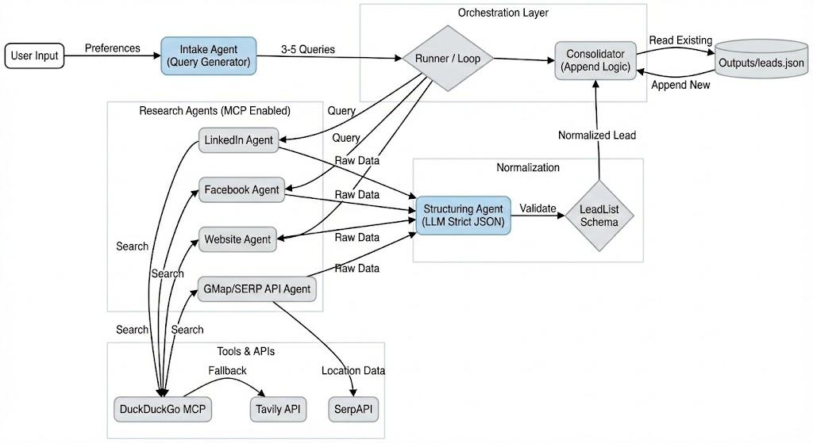

# LeadFoundry AI vDKM (Technical Summary)

## Architecture Diagram

---

## 1. User Input → Query Generation
User preferences are processed by an intake agent that produces **3 to 5 optimized search queries**. These queries act as the root of all downstream lead discovery.

---

## 2. Lead Search Agents
The system runs four research agents:
- LinkedIn research agent
- Facebook research agent
- Company website research agent
- Google Maps or SERP API agent

Each agent:
- Uses MCP search tools when available (DuckDuckGo MCP first, Tavily fallback)
- Never performs scraping or HTML extraction
- Runs inside its own isolated MCP session
- Produces structured or semi-structured lead data for normalization

---

## 3. Multi-run, async-first execution model
LeadFoundry supports **multiple simultaneous research runs**, each identified by a unique **run ID**.

Each run is sandboxed inside:
- its own run folder
- its own configuration
- its own cancellation token
- its own progress files
- its own run-specific MCP sessions

This allows high throughput without cross-contamination.

### 3.1 Strong async architecture
The API uses:
- **asyncio.Task** for non-blocking execution
- **async semaphores** to safely control concurrency
- **asyncio.to_thread** for CPU or blocking I/O fallback
- thread-safe `threading.Event` for pipeline cancellation
- per-run `progress_stage.json` files written with atomic I/O
- async read and write locks preventing race conditions

This creates predictable parallelism even under heavy load.

### 3.2 Safe isolated multi-processing
Every run creates:

/runs/<run_id>/
├── .pipeline.lock
├── inputs/
└── outputs/

This ensures:
- Multiple users can run pipelines in parallel
- Crashes in one run never affect others
- Writes never collide because paths are isolated
- Old runs can be cleaned safely

---

## 4. MCP-enabled multi-source research
For every optimized query:

### 4.1 Search resolution
Agents resolve data using:
- DuckDuckGo Search MCP as primary
- Tavily when MCP returns insufficient results
- SERP API for Google Maps and place-level signals

### 4.2 Structuring and normalization
A strict LLM structuring agent:
- Converts raw agent output into the LeadList schema
- Fills missing fields with "unknown"
- Validates emails, phone numbers, and URLs
- Rejects malformed JSON and retries
- Guarantees deterministic output shape

### 4.3 Full error isolation and strong exception handling
The research layer has resilient exception handling:
- Individual agent failures do not stop the run
- Exceptions are captured as structured error objects
- Partial results are still preserved
- Async tasks isolate failures instead of propagating them
- Pipeline continues to the next query unless cancellation is requested

The goal is stability and safe degradation, not forced success.

---

## 5. Consolidation and Raw Storage
After all queries complete:
- Leads are appended to a consolidated JSON file
- Deduplication is deferred to downstream stages
- Atomic writes guarantee crash-safe persistence
- Backups prevent overwriting valid data
- Invalid or partial writes never corrupt the file

---

## 6. Downstream Processing (external stage)
A dedicated second stage performs:
- deduplication
- contact completeness scoring
- ranking
- Excel export

The research layer focuses solely on producing consistent raw data.

---

## One sentence summary
Async-first, multi-run pipeline with run ID isolation, MCP-powered research agents, strict LLM structuring, atomic JSON persistence, and robust exception handling for safe partial completion even when upstream tools fail.